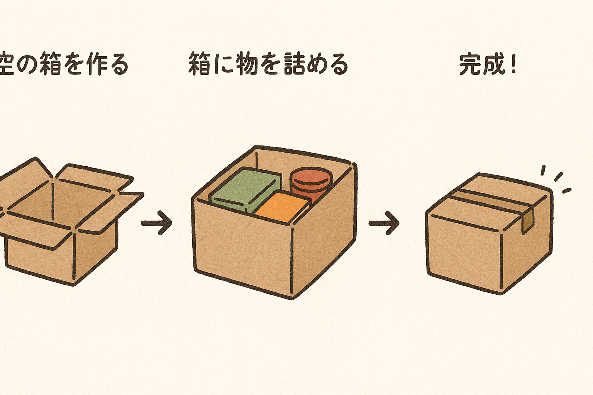
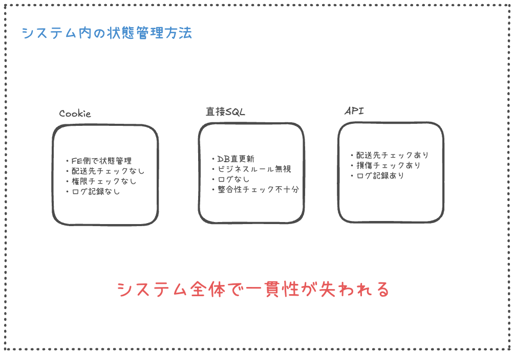
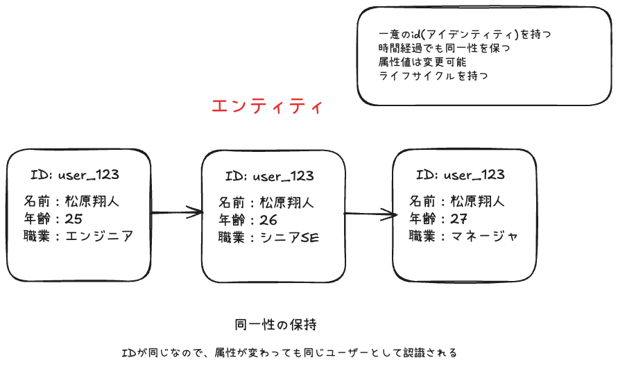
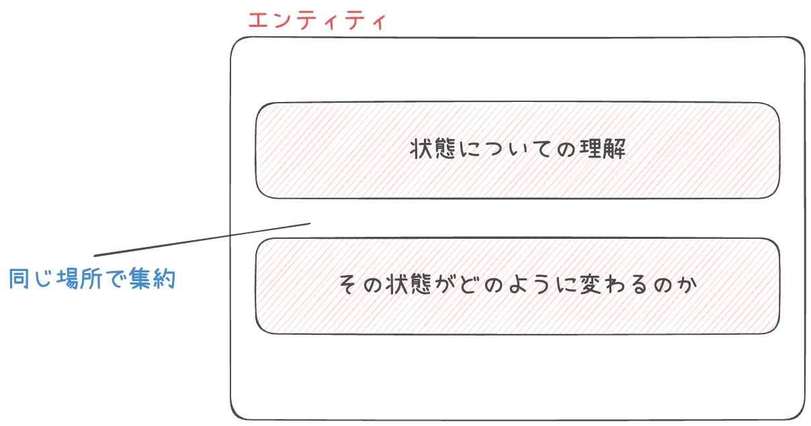

# セキュア・バイ・デザイン 第6章
## 状態の完全性(integrity)の保証

**発表者名** : 松原翔人

---

# 目次

1. **状態の変化とエンティティを使った状態管理**
2. **正しい状態で生成されるエンティティ**
3. **エンティティの完全性（Integrity）**

---

# エンティティを使った状態管理

---

# システムの中心の関心事

**状態の変化** に伴いシステムの **振る舞いがどう変わるか**

---

## 2つの完全性

**1️⃣ 作成時の完全性**  
   - 「正しい状態で生まれる」

**2️⃣ 実行時の完全性**  
   - 「正しい状態を維持する」

→ **両方が揃って初めて安全**

---

## 荷物管理システムの例



--- 


--- 

## 問題
- 各状態の制約を守らずに操作されると？
  - ❌ 検査前に配送開始 → 損傷品の配送
  - ❌ 配送中に内容変更 → データ不整合

→ この複雑さをどう管理する？

---

# 状態管理のごちゃ混ぜ問題
荷物の状態変更が**複数の方法**で行われ、それぞれ異なるルールが適用される。←❌

---



---

# エンティティを使った状態の管理

---

## ちょっとおさらい


---

## エンティティによるモデリング（効果的）

- **状態変化→エンティティが扱うようモデリング**する


---

# 正しい状態のエンティティを作成する方法

---

## なぜ「正しい状態での作成」が重要なのか
**ビジネスルールを守っていないエンティティ** = **セキュリティーホール**

```ts
// 危険な例
const transfer = new BankTransfer();
transfer.setFromAccount(""); // 空の送金元
transfer.setAmount(-1000); // 負の金額
transfer.execute(); // → システムに重大な脆弱性
```

---

## 実際に起こりうる問題

- ❌不正送金の実行
- ❌データ整合性の破綻
- ❌認証しかと

---

## 本書での基本原則

**全てのエンティティが生まれた時から正しい状態でなくてはならない**

## エンティティ = ドメインの守護者
- ビジネスルール違反を**物理的に不可能**にする
- セキュリティを**設計段階**で組み込む

---

## 従来のアプローチの限界
### 🏚️ よくある（危険な）実装パターン

```typescript
// 引数なしコンストラクタ + Setter地獄
Order order = new Order();
order.setCustomerId("123");
order.setAmount(1000);
// ↑ setItemsを忘れがち...

// 結果：不完全なオブジェクトが生まれる
```

---

### 実際に起こる問題
❌ **必須項目の設定忘れ** → 注文に商品が含まれない  
❌ **設定順序への依存** → 金額計算が商品設定前に実行される  
❌ **中途半端な状態での利用** → 検証前にビジネスロジックで使用  
❌ **ルール適用タイミングが不明確** → いつ、どこで検証するのか？

→ **「作成の責任」が呼び出し側に押し付けられている**

---

## 正しい初期状態を作る3つの方法

**1️⃣ 全ての必須の情報をコンストラクタの引数とする**  
**2️⃣ フルーエント・インターフェース**  
**3️⃣ ビルダー・パターン**

→ 段階的に複雑さに対応

---

# 全ての必須の情報をコンストラクタの引数とする

---

## 全ての必須の情報をコンストラクタの引数とする

```typescript
class SecureOrder {
  private readonly customerId: string;
  private readonly amount: number;
  private readonly items: readonly OrderItem[];

  constructor(customerId: string, amount: number, items: OrderItem[]) {
    // 🛡️ 作成時にセキュリティルールを強制適用
    if (!customerId || customerId.length < 3) {
      throw new Error("不正な顧客ID");
    }
    if (amount <= 0 || amount > 1000000) {
      throw new Error("金額が許可範囲外");
    }
    if (!items || items.length === 0) {
      throw new Error("注文項目は必須");
    }

    this.customerId = customerId;
    this.amount = amount;
    this.items = Object.freeze([...items]); // 不変性確保
  }

  ...
}
```

**メリット**
シンプル、確実、高速

---

## メリット
- 学習コスト低
- 実装が簡単
- コンパイル時チェック

## 制約
- 引数が多いと複雑
- 任意項目の扱いが難しい
- 柔軟性に限界

--- 

- **適用場面**
  - 必須項目のみ、シンプルな制約

---

# フルーエント・インターフェース

---

```typescript
class Order {
  private customerId?: string;
  private amount?: number;
  private priority?: string;
  private deliveryDate?: Date;

  withCustomer(customerId: string): Order {
    if (!customerId || customerId.length < 3) {
      throw new Error("不正な顧客ID");
    }
    this.customerId = customerId;
    return this; // 🔗 チェーン可能にする
  }

  withAmount(amount: number): Order {
    if (amount <= 0 || amount > 1000000) {
      throw new Error("金額が許可範囲外");
    }
    this.amount = amount;
    return this;
  }

  ...

}

```

---
```typescript
const order = new Order()
  .withCustomer("CUST-123")
  .withAmount(15000)
  .withPriority("high")
  .withDeliveryDate(tomorrow)
```

流れるような自然な記述

---

## メリット
  - 高い可読性
  - 自然な記述
  - 段階的な構築
  - 任意項目に強い

--- 

## 制約  
- 実装コスト中程度
- **コマンド・クエリ分離違反**
  - メソッドは「変更」または「取得」のどちらか一つの役割に専念すべき
  - `withCustomer()`は状態変更＋自身を返す（2つの役割）
  - 副作用が予測しにくくなる可能性
- 複雑な制約に限界

## 適用場面
- 任意項目多数、単純な制約

---

#  ビルダー・パターン

---

```typescript
class CarBuilder {
  private carType?: 'electric' | 'gasoline' | 'hybrid';
  private engineSize?: number;
  private batteryCapacity?: number;
  private hasAWD?: boolean;

  electric(): CarBuilder {
    this.carType = 'electric';
    this.engineSize = undefined; // 🔒 自動でエンジン除外
    return this;
  }

  gasoline(engineSize: number): CarBuilder {
    if (engineSize <= 0 || engineSize > 8000) {
      throw new Error("エンジンサイズが範囲外");
    }
    this.carType = 'gasoline';
    this.engineSize = engineSize;
    this.batteryCapacity = undefined; // 🔒 バッテリー除外
    return this;
  }

  ...

  build(): Car {
    this.validateAllConstraints(); // 🛡️ 最終検証
    return new Car(this.carType!, this.engineSize, this.batteryCapacity, this.hasAWD);
  }

  private validateAllConstraints(): void {
    if (!this.carType) throw new Error("車種は必須");
    
    if (this.carType === 'electric') {
      if (!this.batteryCapacity) throw new Error("電気自動車にはバッテリー必須");
      if (this.engineSize) throw new Error("電気自動車にエンジンは不要");
    }
    
    if (this.carType === 'gasoline') {
      if (!this.engineSize) throw new Error("ガソリン車にはエンジン必須");
      if (this.batteryCapacity) throw new Error("ガソリン車にバッテリーは不要");
    }
  }
}
```

---

## 使用例

```typescript
// ✅ 電気自動車の作成
const electricCar = new CarBuilder()
  .electric()        // 電気自動車選択（自動でエンジン除外）
  .withBattery(100)  // バッテリー容量設定
  .withAWD()         // AWD設定
  .build();          // 🛡️ 最終検証して作成

// ✅ ガソリン車の作成
const gasolineCar = new CarBuilder()
  .gasoline(2000)    // ガソリン車選択（自動でバッテリー除外）
  .build();

// ❌ 不正な組み合わせは build() 時点で阻止
const invalidCar = new CarBuilder()
  .electric()
  .gasoline(1800)    // 上書きされる
  .build();          // エラー：制約違反
```

---

## メリット
  - 複雑な制約に対応
  - 段階的検証
  - 高い型安全性
  - 変更の局所化

---

## 制約
  - 実装コスト高
  - 学習コスト高
  - オーバーヘッド

## 適用場面
  - 複雑な相互依存、段階的構築必要

---

## 各パターンの比較

| 項目 | コンストラクタ | フルーエント | ビルダー |
|------|---------------|-------------|---------|
| **実装の簡単さ** | ⭐⭐⭐⭐⭐ | ⭐⭐⭐ | ⭐ |
| **学習コスト** | 低 | 中 | 高 |
| **可読性** | ⭐⭐⭐ | ⭐⭐⭐⭐⭐ | ⭐⭐⭐⭐ |
| **型安全性** | ⭐⭐⭐⭐⭐ | ⭐⭐⭐⭐ | ⭐⭐⭐⭐⭐ |
| **セキュリティ** | ⭐⭐⭐⭐ | ⭐⭐⭐ | ⭐⭐⭐⭐⭐ |

---

## 具体例による使い分け

### **ECサイト**
| エンティティ | パターン | 理由 |
|-------------|-------------|------|
| **Product（商品）** | コンストラクタ | `(id, name, price)` - 基本情報のみ |
| **Order（注文）** | フルーエント | 配送先、支払方法など任意項目多数 |
| **Campaign（キャンペーン）** | ビルダー | 複雑な適用条件（期間、対象、割引率） |

---

### **医療システム**
| エンティティ | パターン | 理由 |
|-------------|-------------|------|
| **Patient（患者）** | コンストラクタ | `(id, name, birthDate)` - 基本情報 |
| **Prescription（処方箋）** | ビルダー | 薬剤間の相互作用、アレルギーチェック |
| **Appointment（予約）** | フルーエント | 日時、医師、診療科など設定項目多数 |
---

## O/Rマッパーとの関係
### 🗄️ データベースとの関係

- **問題** 
  - O/Rマッパーが引数なしコンストラクタを要求

- **解決策** 
  - ドメインモデルと永続層モデルを分離

---

```typescript
// 永続層モデル（O/R用）
class OrderEntity {
  constructor() {} // フレームワーク用
}

// ドメインモデル（ビジネス用）  
class Order {
  constructor(customerId: string, amount: number) {
    // ビジネスルール適用
  }
}
```

---

# 実行時の完全性保護

---

## 実行時の脅威
### ⚠️ 作成後に襲いかかる脅威

**オブジェクトは作成後も危険にさらされる**

❌ publicなSetterによる無制限変更  
❌ 可変オブジェクトの共有による意図しない変更  
❌ コレクションの直接操作  
❌ 不正な状態遷移

→ **「作って終わり」ではない！**

---

## カプセル化による防御
### カプセル化 = データとルールの共同防衛

### 定義
データの解釈とルールをそのデータと共に囲い込んで保護すること

---

## 実践的メリット
- **バグの局所化**
  - ルール違反が起きる場所を限定
- **変更の影響範囲縮小**
  - 内部実装変更が外部に影響しない  
- **ビジネスルールの一元管理** 
  - 散らばった検証ロジックを統合
- **テストの簡素化**
  - 境界が明確で、テストしやすい

--- 

**実装方針**

-  publicなSetterを排除
-  制御されたアクセスのみ提供
-  状態変更時にルール適用
-  外部への情報漏洩を防止

---

## Setter排除の実装

```typescript
class Order {
  private _status: OrderStatus = OrderStatus.DRAFT;
  
  // ❌ 危険なSetter
  // setStatus(status: OrderStatus) { this._status = status; }
  
  // ✅ 制御された状態変更
  markAsConfirmed(): void {
    if (this._status !== OrderStatus.DRAFT) {
      throw new Error("下書き状態の注文のみ確定可能");
    }
    this._status = OrderStatus.CONFIRMED;
  }
  
  markAsPaid(): void {
    if (this._status !== OrderStatus.CONFIRMED) {
      throw new Error("確定済み注文のみ支払い可能");
    }
    this._status = OrderStatus.PAID;
  }
}
```

---

## 可変オブジェクトの安全な扱い

**問題**
- 内部オブジェクトが外部で変更される**

```typescript
// ❌ 危険な実装
get items() { return this._items; }

// ✅ 安全な実装
getItems(): readonly OrderItem[] {
  return Object.freeze([...this._items]); // 読み取り専用コピー
}
```

**ポイント**  
• 直接参照を渡さない
• 読み取り専用ビューを提供  
• 変更は内部メソッド経由のみ

---

##  コレクションの完全性保護

```typescript
class Order {
  private _items: OrderItem[] = [];
  
  // ❌ 危険
  // getItems() { return this._items; }
  // setItems(items: OrderItem[]) { this._items = items; }
  
  // ✅ 安全
  getItems(): readonly OrderItem[] {
    return Object.freeze([...this._items]);
  }
  
  addItem(item: OrderItem): void {
    if (this._status !== OrderStatus.DRAFT) {
      throw new Error("確定済み注文には項目追加不可");
    }
    this._items.push(item);
  }
  
  removeItem(itemId: string): void {
    // ビジネスルールに従った削除
  }
}
```

---

## 不変条件（Invariants）による保護

**不変条件とは**
- オブジェクトが「正しい状態」にあるために **常に満たすべきルール**

**例**
- 銀行口座は「常に残高≥0」「口座番号は10桁」を保つ

---

```typescript
class BankAccount {
  constructor(accountNumber: string, balance: number) {
    this.accountNumber = accountNumber;
    this.balance = balance;
    this.checkInvariants(); // 作成時チェック
  }
  
  withdraw(amount: number): void {
    this.balance -= amount;
    this.checkInvariants(); // 操作後チェック
  }
  
  deposit(amount: number): void {
    this.balance += amount;
    this.checkInvariants(); // 全ての操作後にチェック
  }
  
  private checkInvariants(): void {
    if (this.balance < 0) {
      throw new Error("残高は負になれません");
    }
    if (this.accountNumber.length !== 10) {
      throw new Error("口座番号は10桁必須");
    }
    // ビジネスルールを ここで一元管理
  }
}
```

**全てのpublicメソッド実行後に必ずチェック → 常に正しい状態を保証**

---

## 📏 不変条件の設計

**明確な定義**
- 何が「正しい状態」かを明文化
- ビジネスルールと直接対応

**適切なタイミング**
- オブジェクト作成時
- 状態変更後（publicメソッド終了時）

---

## 🛡️ 実行時完全性保護の要点

**目標** 
- 「オブジェクトはライフサイクル全体を通じて**常に正しい状態を保つ**」

**手法**

- Setterの排除 → 制御されたアクセス
- 可変オブジェクト保護 → 読み取り専用ビュー
- コレクション保護 → 内部操作の強制
- 不変条件 → 継続的な整合性チェック

---

# まとめ

---
### 🎯 今日のまとめ

**2つの完全性**  
**作成時**
- 正しい状態で生まれる  

**実行時**
- 正しい状態を維持する

---

## 状態の完全性保証の3つのポイント

1. **エンティティによる状態管理の一元化**
   - 状態変化をDDDのエンティティとしてモデリング
   - 状態とルールを同じ場所で管理

2. **正しい状態でのエンティティ生成**
   - 適切なコンストラクタ設計
   - フルーエント・インターフェースとビルダー・パターンの活用
   - 不変条件の確実な実装

3. **エンティティの完全性保護**
   - カプセル化によるビジネスロジックの保護
   - 可変オブジェクトとコレクションの安全な取り扱い
   - ドメイン・プリミティブの活用
