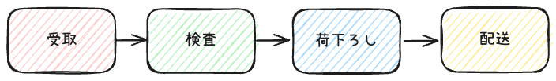
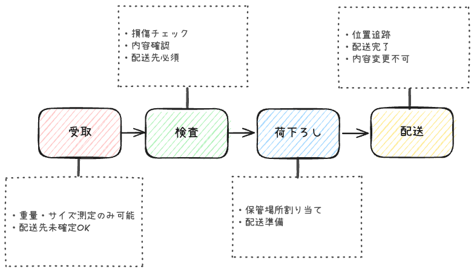

<!-- タイトルスライド -->
<!-- _class: title-slide -->
<!-- _paginate: false -->

# 状態の完全性（Integrity）の保証
## 〜エンティティを正しく作り、正しく保つ〜

**発表者名** : 松原翔人

---

# ゴール
## この発表で得られるもの


1. **エンティティの状態管理における課題の理解**
2. **段階的なセキュリティ強化手法の習得**（抽象的かも）
3. **実践パターンの使い分けスキル**
4. **明日から使える具体的なコード例**

---

# 目次


1. **なぜ状態管理が重要なのか**
2. **正しい状態のエンティティの作り方**
3. **エンティティの完全性**
4. **総合的な保護戦略**

---

<!-- _class: section-divider -->
<!-- _paginate: false -->

# 問題定義

<div class="section-number">01</div>

---

# DDDにおける状態管理の位置付け

### エンティティ
- 識別性(Identity)を持つ
- ライフサイクルを通じて追跡される（よくわからん）
- ↑ **常に整合性を保つ必要がある** ← 今日のテーマ

<div class="highlight">状態の破綻 = ビズネス価値の毀損</div>

---

# よくある問題シナリオ

- ❌ 空の注文オブジェクトが作られる
- ❌ 支払い済み注文が未払いに戻る
- ❌ 存在しない商品IDで注文作成
- ❌ 負の残高を持つ口座
- ❌ 無効な状態遷移

<div class="emphasis">これらは「防げる」問題</div>

---

# レガシーな「引数なしコンストラクタ」

## 「空っぽの箱を先に作って、後から中身を詰める方式」
###  　　↑使う価値なし



---
具体的なソースコード

---
# 状態変化の複雑さ



- 各状態で**可能な操作**、**必要な情報**、**ビジネスルール**が変わる

---

# エンティティによる状態管理


---

<!-- セクション2の扉 -->
<!-- _class: section-divider -->
<!-- _paginate: false -->

# 背景・課題
## Background & Issues

<div class="section-number">02</div>

---

# 現状の課題

## 主要な問題点

1. **効率性の低下**
   - 作業時間の増加
   - リソースの無駄遣い

2. **品質の問題**
   - エラー率の増加
   - 顧客満足度の低下

3. **コスト面の課題**
   - 運用コストの増大
   - ROIの悪化

---

# 正しいエンティティ作成のアプローチ

| 手法 | 適用ケース | メリット | デメリット |
|------|------|------|----------|
| 必須情報を全てコンストラクタ引数 | シンプルなエンティティ | 確実性 | 引数が多いと複雑 |
| フルーエントインターフェース | 任意フィールドが多い | 可読性 | 複数フィールド制約に対応困難 |
| ビルダーパターン | 複雑な制約あり | 柔軟性 | 実装が複雑 |

<div class="emphasis">目標：作成されるオブジェクトは全てビジネスルールを満たしていることを保証</div>

---

<!-- セクション3の扉 -->
<!-- _class: section-divider -->
<!-- _paginate: false -->

# 実践的な設計パターン
## Practical Design Patterns

<div class="section-number">03</div>

---

# ビルダーパターンの活用

<!-- _class: large-text -->

## 基本的な考え方

1. **複雑な制約をビルダー内で隠蔽**
2. **オブジェクト作成完了まで外部アクセス禁止**  
3. **フルーエントインターフェースとの組み合わせ**

---

# フルーエントインターフェースの特徴

<!-- _class: three-columns -->

## メリット
**可読性の向上**
- 自然言語のようなコード
- メソッドチェーンによる流暢性
- 理解しやすいAPI

## デメリット
**制約の問題**
- コマンド・クエリ分離原則違反
- 複数フィールド制約対応困難
- 不完全な状態の可能性

## 解決策
**ビルダーパターン**
- 複雑な制約の隠蔽
- 完成まで外部アクセス禁止
- 内部クラスでの実装

---

# TypeScriptでのビルダーパターン実装

## Carエンティティの例

```typescript
class Car {
  private constructor(
    private readonly brand: string,
    private readonly isElectric: boolean,
    private readonly engineSize?: number
  ) {
    this.validateInvariants();
  }

  static builder(): CarBuilder {
    return new CarBuilder();
  }

  private validateInvariants(): void {
    if (this.isElectric && this.engineSize) {
      throw new Error('電気自動車にエンジンサイズは設定できません');
    }
  }

  getBrand(): string { return this.brand; }
  isElectricVehicle(): boolean { return this.isElectric; }
  getEngineSize(): number | undefined { return this.engineSize; }
}

class CarBuilder {
  private brand?: string;
  private isElectric: boolean = false;
  private engineSize?: number;

  setBrand(brand: string): CarBuilder {
    this.brand = brand;
    return this;
  }

  setElectric(): CarBuilder {
    this.isElectric = true;
    this.engineSize = undefined; // 電気車はエンジンサイズなし
    return this;
  }

  setEngineSize(size: number): CarBuilder {
    if (this.isElectric) {
      throw new Error('電気自動車にエンジンサイズは設定できません');
    }
    this.engineSize = size;
    return this;
  }

  build(): Car {
    if (!this.brand) {
      throw new Error('ブランドは必須です');
    }
    return new Car(this.brand, this.isElectric, this.engineSize);
  }
}
```

## 期待される効果

- **安全性**: <span class="highlight">不正な状態のオブジェクト作成を防止</span>
- **保守性**: <span class="highlight">制約をコードで明示的に表現</span>
- **可読性**: <span class="highlight">ビジネスルールの可視化</span>

---

<!-- セクション4の扉 -->
<!-- _class: section-divider -->
<!-- _paginate: false -->

# エンティティの完全性保護
## Entity Integrity Protection

<div class="section-number">04</div>

---

# カプセル化と完全性保護

## Getter/Setterの問題点

- ❗ **public setterの危険性**: データフィールドがprivateでも外部から自由に変更可能
- ❗ **ビジネスルールを無視**: 制約をスキップして状態変更
- ❗ **一貫性の破綱**: 状態管理ロジックが分散

## 解決策

- **一方向の変更メソッド**: `setPaid()`ではなく`markPaid()`
- **ドメインプリミティブの活用**: 不変オブジェクトで安全な共有
- **カプセル化**: データとルールを同じ場所で管理

---

# コレクションの完全性保護

<!-- _class: center -->

## コレクションの問題と対策

| **問題** | **危険性** | **対策** | **効果** |
|----------|------------|------------|------------|
| 内部Listを直接返す | 🚫 外部から変更可能 | 読み取り専用ビュー返却 | ✅ 安全性向上 |
| SetterでList一括設定 | 🚫 ビジネスルールスキップ | エンティティ内でのみ操作 | ✅ ルール遵守 |
| 可変オブジェクト共有 | 🚫 意図しない変更 | Collections.unmodifiableList | ✅ 不変性保証 |

---

<!-- セクション5の扉 -->
<!-- _class: section-divider -->
<!-- _paginate: false -->

# まとめ・重要なポイント
## Summary & Key Points

<div class="section-number">05</div>

---

# 状態完全性保証の核心原則

<!-- _class: center -->

## 3つの柱

<div class="highlight">正しい状態での生成 + 完全性の保護 + 適切な設計パターン</div>

### 重要なポイント

1. **エンティティによる状態管理の一元化**
2. **ビジネスルールをコードで表現**
3. **不変条件の維持とカプセル化**

---

# 実践での選択指針

## シンプルなケース

- 必須情報を全てコンストラクタ引数に
- 任意情報はSetterメソッドで設定
- コンストラクタ内でnullチェック実施

## 複雑な制約があるケース

- ビルダーパターンの採用
- 内部クラスでのカプセル化
- フルーエントインターフェースとの組み合わせ

<div class="note">
ビルダーの生存期間は短く、一度のリクエスト内で完結させる
</div>

---

<!-- 終了スライド -->
<!-- _class: title-slide -->
<!-- _paginate: false -->

# ありがとうございました

## ご質問・ご討議

**Contact Information**  
📧 email@example.com  
📱 000-0000-0000

---

<!-- 補足資料の扉（必要に応じて） -->
<!-- _class: section-divider -->
<!-- _paginate: false -->

# 補足資料
## Appendix

<div class="section-number">APP</div>

---

# 追加のTypeScriptコード例

## コレクションの安全な取り扱い

```typescript
class Order {
  private orderItems: OrderItem[] = [];

  // 外部に直接Listを渡さない
  getOrderItems(): readonly OrderItem[] {
    return Object.freeze([...this.orderItems]);
  }

  // エンティティ内でのみ操作を許可
  addOrderItem(item: OrderItem): void {
    if (this.orderItems.length >= 10) {
      throw new Error('注文アイテムは10個までです');
    }
    this.orderItems.push(item);
  }

  removeOrderItem(itemId: string): boolean {
    const index = this.orderItems.findIndex(item => item.getId() === itemId);
    if (index >= 0) {
      this.orderItems.splice(index, 1);
      return true;
    }
    return false;
  }

  getTotalAmount(): number {
    return this.orderItems.reduce((sum, item) => sum + item.getPrice(), 0);
  }
}

class OrderItem {
  constructor(
    private readonly id: string,
    private readonly name: string,
    private readonly price: number
  ) {
    if (price <= 0) {
      throw new Error('価格は0より大きい値である必要があります');
    }
  }

  getId(): string { return this.id; }
  getName(): string { return this.name; }
  getPrice(): number { return this.price; }
}
```

<div class="note">
セキュア・バイ・デザイン 第6章「状態の完全性の保証」より
</div>