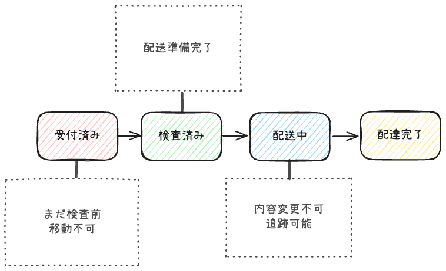

<!-- _class: lead -->

# セキュア・バイ・デザイン 第6章

## 状態の完全性(integrity)の保証
  
発表者: 松原翔人

---

<!-- _class:  -->

# 🚨 危険なコードクイズ

```typescript
const transfer = new BankTransfer();
    transfer.setAmount(request.body.amount);
    transfer.setFromAccount(request.body.from);
    transfer.execute();
```

**このコードの何が危険？**

---

# 🎯 本日のゴール

## 学習目標

**1️⃣ エンティティが「生まれた時から正しい」ことの意味を理解**

**2️⃣ 状況に応じた実装パターンを選択できるようになる**

**3️⃣ 明日から実践できる改善策を持ち帰る**

---

# 📋 目次

## **1. 理論編** - 2つの完全性とエンティティの役割
## **2. 実装編** - 3つのパターンと実践的な選択  
## **3. 防御編** - 実行時の完全性保護
## **4. まとめ** - 実践への落とし込み

---

# 💡 2つの完全性

## **1️⃣ 作成時の完全性**  
「正しい状態で生まれる」

## **2️⃣ 実行時の完全性**  
「正しい状態を維持する」

### 🔑 **両方が揃って初めて安全**

---

<!-- _class: chapter -->

# 📚 理論編

## 2つの完全性とエンティティの役割

---

# 🎯 システムの中心的関心事

## **<span class="highlight">状態の変化</span>** に伴い
## システムの **<span class="highlight">振る舞いがどう変わるか</span>**

### 状態管理の複雑さ = セキュリティリスクの温床

---

# 📦 荷物管理システムの例



---

# ⚠️ 【問題】 検査前に配送したら？

## 起こりうる問題
- ❌ **損傷品の配送** → 顧客クレーム
- ❌ **データ不整合** → システム障害
- ❌ **セキュリティホール** → 悪意のある操作

### 💭 この複雑さをどう管理する？

---

# 🌀 状態管理のアンチパターン

## **ごちゃ混ぜ問題**

- **Cookie** で状態管理
- **SQL** で直接操作  
- **API** で状態変更
- **UI** からの直接操作

### ❌ **ルールが散在すると、必ず漏れが生じる**

---

# DDDのエンティティとは

## **アイデンティティ + 状態変化 = エンティティ**

### 特徴
- **同一性を保ちながら状態が変わる**
- **ビジネスルールを内包する**
- **一意の識別子を持つ**


---

# ✅ エンティティによる解決

## **状態とルールを同じ場所で管理**

### **エンティティ = <span class="highlight">ドメインの守護者</span>**

- 状態変更時に自動でルール適用
- ビジネスロジックの一元化
- アグリゲート境界での整合性保証

---

# 🚨 なぜ「正しい状態での作成」が重要？

## **ビジネスルール違反 = セキュリティホール**

```typescript
// 危険な例
const transfer = new BankTransfer();
  transfer.setFromAccount(""); // 空の送金元
  transfer.setAmount(-1000); // 負の金額
  transfer.execute(); // → 重大な脆弱性
```

### 実例：ECサイトで0円購入が可能に...

---

# 本書での基本原則

## **全てのエンティティが生まれた時から**
## **正しい状態でなくてはならない**

### **エンティティ = ドメインの守護者**
- ビジネスルール違反を**物理的に不可能**にする
- セキュリティを**設計段階**で組み込む

---

# 🏚️ 従来のアプローチの限界

## よくある（危険な）実装パターン

```typescript
// 引数なしコンストラクタ + Setter地獄
const order = new Order();
order.setCustomerId("123");
order.setAmount(1000);
// ↑ setItemsを忘れがち...
```

### **結果：不完全なオブジェクトが生まれる**

---

# 💥 実際に起こる問題

## ❌ **必須項目の設定忘れ**
注文に商品が含まれない

## ❌ **設定順序への依存**  
金額計算が商品設定前に実行

## ❌ **中途半端な状態での利用**
検証前にビジネスロジックで使用

---

<!-- _class: chapter -->

# 🔧 実装編

## 正しい状態のエンティティを作成する方法

---

# 🎯 3つのパターン概観

## **段階的アプローチ**

**1️⃣ 全ての必須の情報をコンストラクタの引数とする** - シンプル→確実  
**2️⃣ フルーエント** - 可読性重視  
**3️⃣ ビルダー** - 複雑な制約対応

### 🎯 **適材適所が重要**

---

# 🔧 全ての必須の情報をコンストラクタの引数とする

## **全ての必須情報を引数で受け取る**

```typescript
class SecureOrder {
  constructor(
    customerId: string, 
    amount: number, 
    items: OrderItem[]
  ) {
    // 🛡️ 作成時にルール強制適用
    this.validateAndSet(customerId, amount, items);
  }
}
```

---

# ✅ コンストラクタのメリット

- **学習コスト低** - 最もシンプル
- **実装が簡単** - すぐに書ける  
- **コンパイル時チェック** - 型安全
- **高速** - オーバーヘッドなし

---

# ⚠️ コンストラクタの制約

- **引数が多いと複雑**
- **任意項目の扱いが難しい**
- **柔軟性に限界** - 固定的な構造

### 🎯 **適用場面**
必須項目のみ、シンプルな制約

---

# 🌊 パターン2: フルーエント・インターフェース

## **流れるような記述**

```typescript
const order = new Order()
  .withCustomer("CUST-123")
  .withAmount(15000)
  .withPriority("high")
  .withDeliveryDate(tomorrow)
```

### **自然言語のような可読性**

---

# 🔧 フルーエント・インターフェースの実装

```typescript
class Order {
  withCustomer(customerId: string): Order {
    this.validateCustomerId(customerId);
    this.customerId = customerId;
    return this; // 🔗 チェーン可能
  }

  withAmount(amount: number): Order {
    this.validateAmount(amount);
    this.amount = amount;
    return this;
  }
}
```

---

# ✅ フルーエント・インターフェースのメリット

- **高い可読性** - 自然な記述
- **自然な記述** - ドメイン表現に近い  
- **段階的な構築** - 必要な分だけ設定
- **任意項目に強い** - 柔軟な組み合わせ

---

# ⚠️ フルーエント・インターフェースの制約

- **実装コスト中程度** - メソッド数が多い
- **コマンド・クエリ分離違反** - 変更+返却
- **複雑な制約に限界** - 項目間依存が難しい

### 🎯 **適用場面**
任意項目多数、単純な制約

---

# 🏗️ パターン3: ビルダー・パターン

## **複雑な制約を安全に処理**

```typescript
const electricCar = new CarBuilder()
  .electric()        // 自動でエンジン除外
  .withBattery(100)  // バッテリー容量設定
  .withAWD()         // AWD設定
  .build();          // 🛡️ 最終検証
```

---

# 🔧 ビルダーの実装例

```typescript
class CarBuilder {
  electric(): CarBuilder {
    this.carType = 'electric';
    this.engineSize = undefined; // 電気自動車なのでエンジン除外
    return this;
  }

  ・・・

  build(): Car {
    this.validateAllConstraints(); //  最終検証
    return new Car(/* validated params */);
  }
}
```

---

# ✅ ビルダーのメリット

- **複雑な制約に対応** - 相互排他的な条件も
- **段階的検証** - 必要なタイミングで検証  
- **高い型安全性** - コンパイル時エラー
- **変更の局所化** - 影響範囲を限定

---

# ⚠️ ビルダーの制約

- **実装コスト高** - コード量が多い
- **学習コスト高** - パターン理解が必要
- **オーバーヘッド** - 実行時コスト

### 🎯 **適用場面**
複雑な相互依存、段階的構築必要

---

# 📊 パターン比較表

| 項目 | コンストラクタ | フルーエント | ビルダー |
|------|---------------|-------------|---------|
| **実装の簡単さ** | ⭐⭐⭐⭐⭐ | ⭐⭐⭐ | ⭐ |
| **学習コスト** | 低 | 中 | 高 |
| **可読性** | ⭐⭐⭐ | ⭐⭐⭐⭐⭐ | ⭐⭐⭐⭐ |
| **型安全性** | ⭐⭐⭐⭐⭐ | ⭐⭐⭐⭐ | ⭐⭐⭐⭐⭐ |

---

# 🏢 実プロジェクト適用例：ECサイト

| エンティティ | パターン | 理由 |
|-------------|----------|------|
| **Product** | コンストラクタ | `(id, name, price)` 基本情報のみ |
| **Order** | フルーエント | 配送先、支払方法など任意項目多数 |
| **Campaign** | ビルダー | 複雑な適用条件（期間、対象、割引率） |

---

# 🏥 実プロジェクト適用例：医療システム

| エンティティ | パターン | 理由 |
|-------------|----------|------|
| **Patient** | コンストラクタ | `(id, name, birthDate)` 基本情報 |
| **Prescription** | ビルダー | 薬剤間の相互作用、アレルギーチェック |
| **Appointment** | フルーエント | 日時、医師、診療科など設定項目多数 |

---

<!-- _class: chapter -->

# 🛡️ 防御編

## エンティティの完全性保護

---

# ⚠️ 実行時の脅威

## **「作って終わり」ではない！**

### オブジェクトは作成後も危険にさらされる

❌ **publicなSetter** による無制限変更  
❌ **可変オブジェクトの共有** による意図しない変更  
❌ **コレクションの直接操作**  
❌ **不正な状態遷移**

---

# 🛡️ カプセル化による防御

## **カプセル化 = データとルールの共同防衛**

### **定義**
データの解釈とルールをそのデータと共に  
囲い込んで保護すること

---

# 💪 カプセル化の実践的メリット

- **バグの局所化** - ルール違反の発生場所を限定
- **変更の影響範囲縮小** - 内部実装変更が外部に影響しない  
- **ビジネスルールの一元管理** - 散らばった検証ロジックを統合
- **テストの簡素化** - 境界が明確で、テストしやすい

---

# 🎯 実装方針

## **4つの原則**

**1️⃣ publicなSetterを排除**  
**2️⃣ 制御されたアクセスのみ提供**  
**3️⃣ 状態変更時にルール適用**  
**4️⃣ 外部への情報漏洩を防止**

---

# ❌ Setter排除の実装

```typescript
class Order {
  private _status = OrderStatus.DRAFT;
  
  // ❌ 危険なSetter
  // setStatus(status: OrderStatus) { this._status = status; }
  
  // ✅ 制御された状態変更
  markAsConfirmed(): void {
    if (this._status !== OrderStatus.DRAFT) {
      throw new Error("下書き状態の注文のみ確定可能");
    }
    this._status = OrderStatus.CONFIRMED;
  }
}
```

---

# 🔒 可変オブジェクトの安全な扱い

## **問題**
内部オブジェクトが外部で変更される

```typescript
// ❌ 危険な実装
get items() { return this._items; }

// ✅ 安全な実装
getItems(): readonly OrderItem[] {
  return Object.freeze([...this._items]);
}
```

---

# 📦 コレクションの完全性保護

---

```typescript
class Order {
  private _items: OrderItem[] = [];
  
  // ❌ 危険
  // getItems() { return this._items; }
  
  // ✅ 安全
  getItems(): readonly OrderItem[] {
    return Object.freeze([...this._items]);
  }
  
  addItem(item: OrderItem): void {
    if (this._status !== OrderStatus.DRAFT) {
      throw new Error("確定済み注文には項目追加不可");
    }
    this._items.push(item);
  }
}
```

---

# 🔐 不変条件（Invariants）

## **不変条件とは**
オブジェクトが「正しい状態」にあるために  
**常に満たすべきルール**

### **例**
- 銀行口座は「常に残高≥0」
- 口座番号は「10桁」を保つ

---

# 🔧 不変条件の実装

```typescript
class BankAccount {
  constructor(accountNumber: string, balance: number) {
    this.accountNumber = accountNumber;
    this.balance = balance;
    this.checkInvariants(); // 作成時チェック
  }
  
  withdraw(amount: number): void {
    this.balance -= amount;
    this.checkInvariants(); // 操作後チェック
  }
  
  private checkInvariants(): void {
    if (this.balance < 0) {
      throw new Error("残高は負になれません");
    }
    // 全てのルールをここで一元管理
  }
}
```

---

<!-- _class: chapter -->

# 📝 まとめ

## 実践への落とし込み

---

# 🗄️ O/Rマッパーとの関係

## **ドメインモデルと永続層モデルの分離**

```typescript
// 永続層モデル（O/R用）
class OrderEntity {
  constructor() {} // フレームワーク用
}

// ドメインモデル（ビジネス用）  
class Order {
  constructor(customerId: string, amount: number) {
    // ビジネスルール適用
  }
}
```

---

# 🎯 今日の学び - 3つのポイント

## **1️⃣ エンティティによる状態管理の一元化**
状態変化をDDDのエンティティとしてモデリング

## **2️⃣ 正しい状態でのエンティティ生成**  
適切なパターン選択とルール適用

## **3️⃣ エンティティの完全性保護**
カプセル化と不変条件による防御

---

# 🚀 明日から実践できる3つのアクション

## **1️⃣ まず1つ、引数なしコンストラクタを撲滅**

## **2️⃣ Setterを1つずつ、意味のあるメソッドに置換**

## **3️⃣ 新規開発では最初から適切なパターンを選択**

---